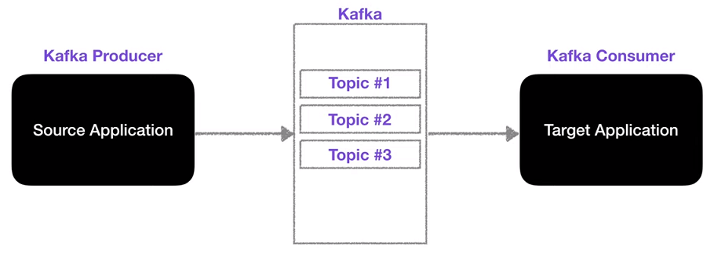
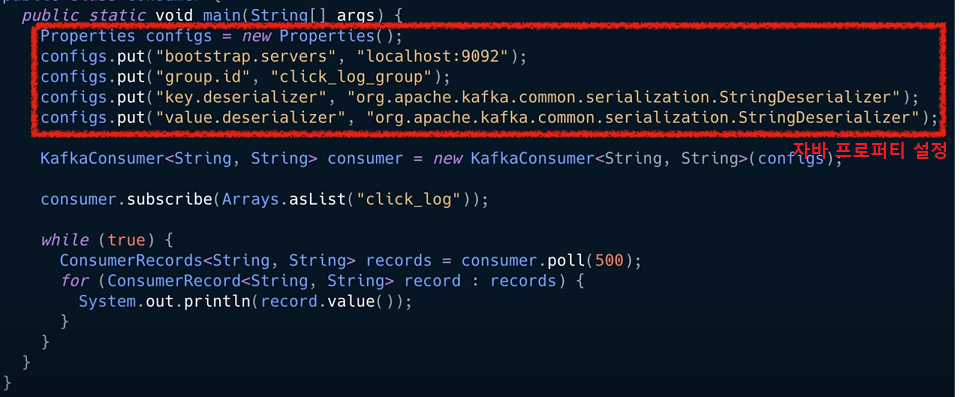

# Apache Kafka

[TOC]

**`강의` 아파치 카프카 | 카프카 컨슈머 역할👌 및 코드예제**

다른 메시징 시스템들에서는 컨슈머가 데이터를 가져가면 queue 내부 데이터가 사라지는데 카프카에서는 컨슈머가 데이터를 가져가도 데이터가 사라지지 않음

카프카 컨슈머가 데이터 파이프라인으로서 어떻게 동작하는지

그리고 카프카 컨슈머의 역할에 대해서 알아보자

## 카프카 컨슈머란?

카프카 컨슈머는 기본적으로 토픽의 데이터를 가져온다.
즉, 데이터는 Topic 내부의 partition에 저장되고 컨슈머는 partition에 저장된 데이터를 가져온다.

이렇게 데이터를 가져오는것을 폴링(polling)이라고 한다.

### Consumer의 역할

- Topic 내부의 partition으로부터 메시지를 가져오는 것
  메시지를 가져와서 특정 데이터베이스에 저장하거나 또 다른 파이프라인에 전달할 수 있다.
- Partition **offset[^1]** 위치 기록(commit)
- Consumer가 여러 개일 경우, Consumer group을 통해 병렬처리
  partition 개수에 따라 컨슈머를 여러개 만들면 병렬처리가 가능하기 때문에 더욱 빠른 속도로 데이터를 처리할 수 있다.

 

컨슈머를 사용하기 위해서는 이전 프로듀서를 사용할 때처럼 라이브러리를 추가해야 한다.
기본적으로 자바 라이브러리를 지원하며 Gradle이나 Maven 같은 라이브러리 관리 도구를 사용하면 편리하게 사용할 수 있다.
카프카 브로커와 클라이언트의 버전호환성을 확인 후 사용하는 것을 추천한다.

[아파치 카프카 버젼별 하위호환](https://blog.voidmainvoid.net/193)

 

### 카프카 컨슈머를 작성한 코드 참고

컨슈머를 사용하기 위해 먼저 자바 프로퍼티를 설정해야 한다.
자바 프로퍼티를 통해 기본적인 컨슈머 옵션을 지정할 수 있다.

bootstrap servers 옵션을 통해 카프카 브로커를 설정한다.
→ 카프카 브로커 중 한 개의 이슈가 생기면 다른 브로커가 붙을 수 있도록 여러 개의 브로커를 지정하는 것을 추천한다.

그룹 아이디를 지정해야 한다.
→ 그룹 아이디는 컨슈머 그룹이라고도 불리는데, 말 그대로 컨슈머들의 묶음이라고 생각하면 된다. 그리고 이전에 프로듀서에게 설정한 바와 같이 key 와 value에 대한 직렬화 설정을 추가해 준다.

컨슈머를 생성하기 위한 기본 설정이 완료되었다.

## 참고자료

[아파치 카프카 | 카프카 컨슈머 역할👌 및 코드예제](https://www.youtube.com/watch?v=rBVCvv9skT4&t=1s)

[^1]: 파티션에 있는 데이터의 번호를 뜻한다.